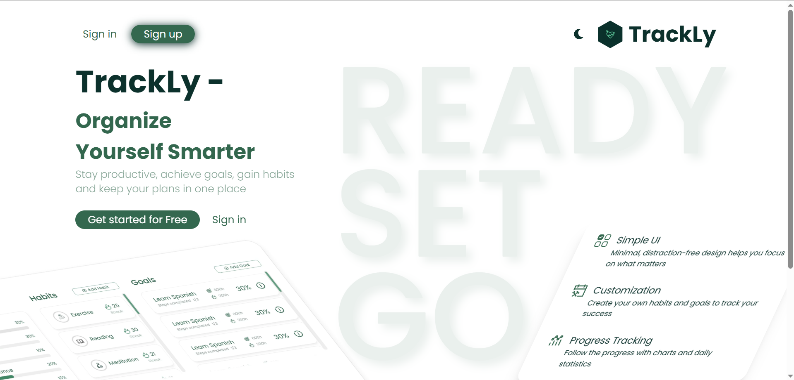
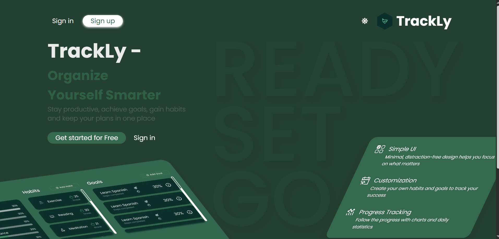
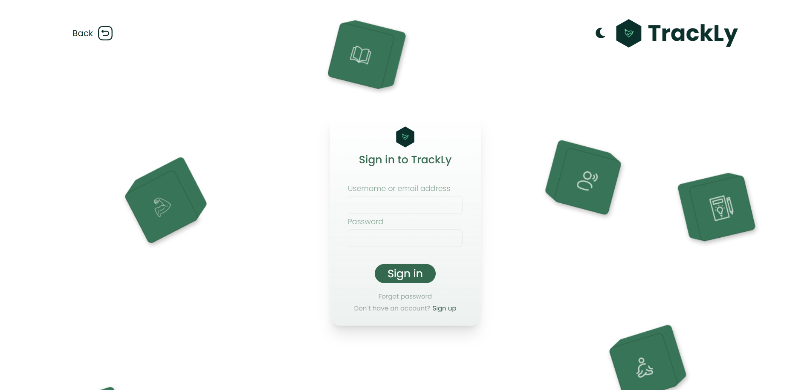
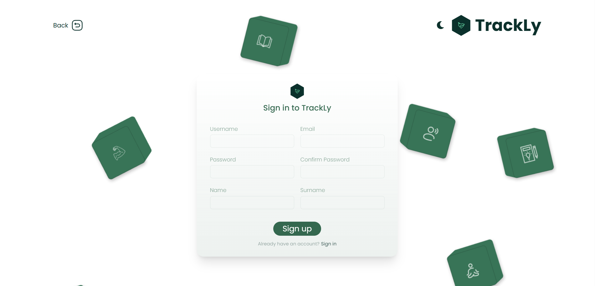

This is a goals and habits tracking system Trackly. 
Project developed with following stack of technologies:
- Next.js v15
- TypeScript
- React Hook Form v7
- Tanstack Query
- Tailwind v4
- Node.js v22
- Express v5
- MongoDB
- Zod
- Docker + Nginx
- SwaggerUI (for documentation)

## Getting Started

#### Import postman collection from repo to desktop app to have access to backend routes
#### 1. Install all the required node modules

```bash
cd frontend 

npm i

cd ..

cd backend

npm i
```

#### 2. Build and run the containers

Run command below from project root directory

```bash
docker compose up --build backend frontend-prod nginx
```

Open [http://localhost](http://localhost) with your browser to see the result.

### API documentation provided

Once backend container is up, open [http://localhost/api/docs](http://localhost/api/docs) to read available docs







